# State Legislation Topic Modeling 

## Business Case 
Changes in laws and regulations can pose major business risks and opportunities across all industry sectors. To navigate this risk, companies need to be aware of proposed legislation that could impact their business. Reading over every bill is an inefficient, time consuming and expensive task. 

Machine Learning can vastly reduce this burden through topic modeling. Topic modeling enables companies to filter out bills unrelated to their business and to focus their attention on bills that will most likely affect their operations. 

The below analysis performs topic modeling on state legislation pertaining to the energy sector. However, the same framework can be applied to model topics for any of the tracked categories of legislation on the [NCLS' website](https://www.ncsl.org/research/telecommunications-and-information-technology/ncsl-50-state-searchable-bill-tracking-databases.aspx). 

## The Data 

As mentioned above, the data used was exctracted from the [NCLS' website](https://www.ncsl.org/research/telecommunications-and-information-technology/ncsl-50-state-searchable-bill-tracking-databases.aspx). The first step in the data collection process was to extract the below table via the database search. 

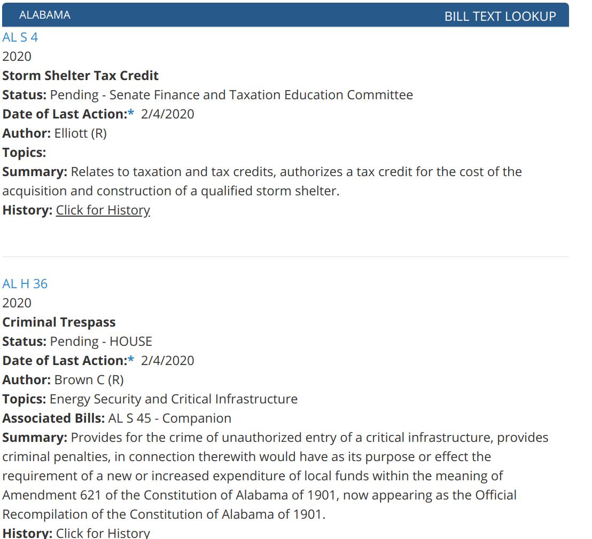

As you can see, the bills already have topics assigned to them, but many bills are missing values for that field. As shown later, much of the value is derived from modeling subtopics. 

Once the table was extracted, Python's BeautifulSoup module was employed to scrape the page's html file, in order to navigate to each individual bill link and extract the bill text from each link. 

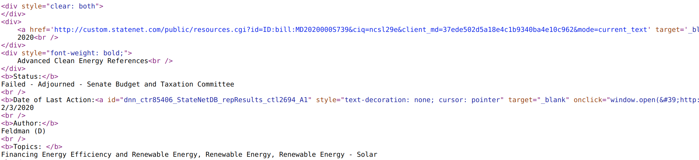

At this point the dataset contained the following fields: 
-   bill_id (str)
-   title   (str)
-   year    (int)
-   status  (str)
-   topics  (str)
-   summary (str)
-   associated bills (str)
-   date of last action (str)
-   author  (str)
-   text    (str)

Many of these fields contained additional information related to the bill, such as primary authors of the bill and then additional authors. Below are the additional features that were extracted from the previous features:
-   state   (str)
-   additional authors (str)
-   primary_dem (int)
-   primary_rep (int)
-   additional_dem (int)
-   additional_rep  (int)

Duplicate bills were identified and removed by locating bills with identical text and state features, as well as locating bills with identical bill_ids and author. After the cleaning process, 12,711 unique bills remained. 

## Topic Modeling Pipeline 

Each document in the corpus for topic modeling was composed of the text feature for each row in the dataset. The first step in preparing the feature for topic modeling was to convert the entire string to lowercase and remove punctuation. Each word was then passed through NLTK's WordNet lemmatizer. To reduce the impact of "legalize" and other non-descriptive words a custom stop words list was created and all words in the list were removed. The custom stop words list can be viewed in the file get_stop_words.py located in the src directory. All remaining words in the corpus were then tokenized and a term frequency inverse document frequency (tf_idf) matrix was then created using the tokens. Finally, the tf_idf matrix was then passed through a clustering algorithm (k means, NMF) to derive the topics. 

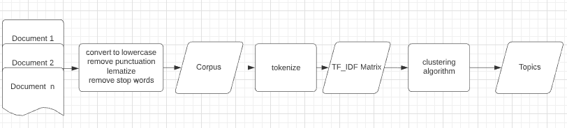 

## Topic Selection

An iterative approach was employed to select the number of topics. The corpus was continually passed through the topic modeling pipeline until distinct and interpretable topics were returned. At each iteration the top words for each cluster were examined to determine whether or not the cluster was representative of an interpretable topic. Non-informative general words were also added to the stop words list as appropriate. 

The final algorithm landed on for modeling the primary topics was k means hard clustering with n = 7 number of topics. The k means hard clustering algorithm was chosen because it enabled the assignment of a distinct topic to each document in the corpus. Additionally, the hyper parameter n = 7 was chosen because it returned distinct interpretable topics. 
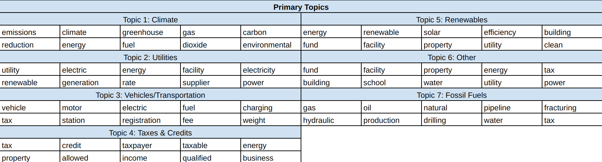
After assigning each document a primary topic, the same process was employed for modeling subtopics except that this time the corpus consisted only of documents belonging to the same primary topic. A different number of subtopics was used for each primary topic but non negative matrix factorization (NMF) was used to model the subtopics. A soft clustering technique was employed because many of the subtopics were less distinct and it seemed likely that each bill could pertain to multiple subtopics. The below table shows the subtopics for topic 7 fossil fuels. 
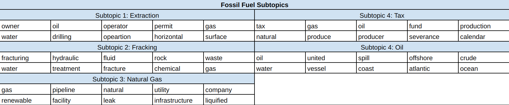

## Topic Analysis 

To confirm that the clusters (topics) were capturing the structure of the data, principal component analysis was performed on the tf_idf matrix to reduce its dimensionality down to two componets. Each document was then plotted with the X axis being the first principal component and the Y axis being the second principal component. Each document was also assigned a color based on which cluster it belonged to. 
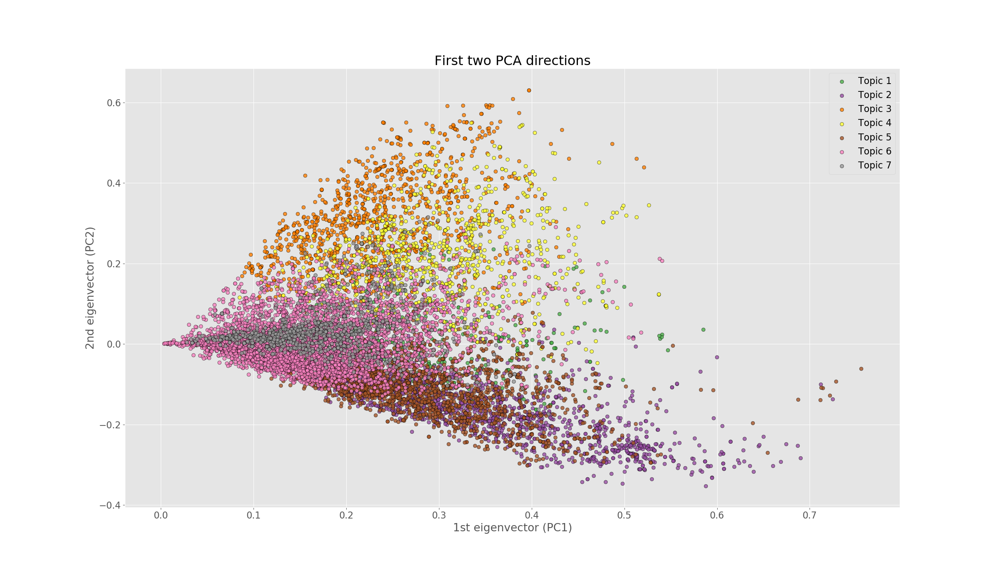

Although there is overlap between the clusters, a clear distinction can be made between many of clusters in the scatterplot. This helps confirm that the topics are capturing the structure of the data. 

To understand the distribution of primary topics, the below bar chart was created, which shows the number of documents (bills) assigned to each topic. 
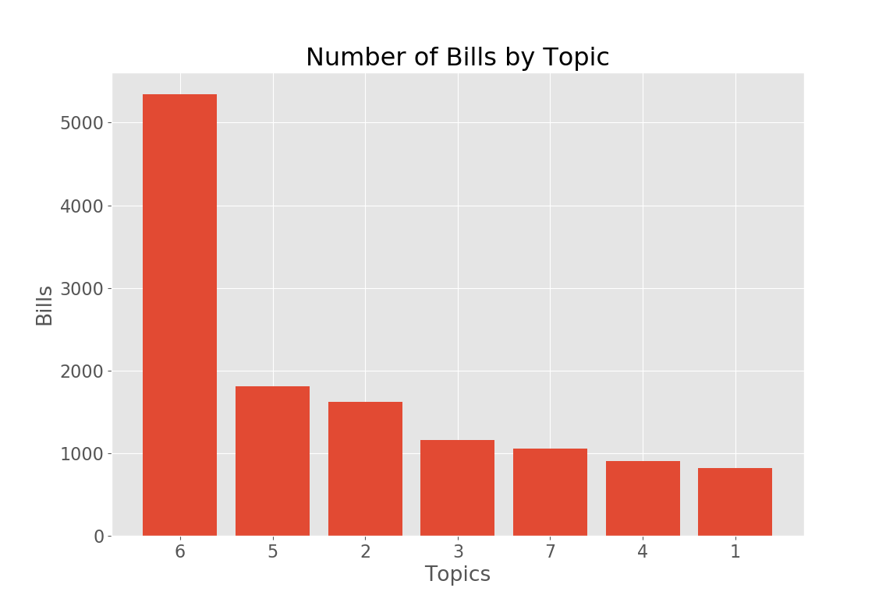

The bar chart shows that most bills relate to topic 6, the 'Other' topic. Further clustering could be employed on this topic to provide more meaningful insights. However, the principal component analysis showed that the underlying structure of the data was captured by these topics, so these seven primary topics were used for the duration of the analysis. 

These primary topics provide insights into the volatility of the legal structure for each topic. Take the below charts for example:
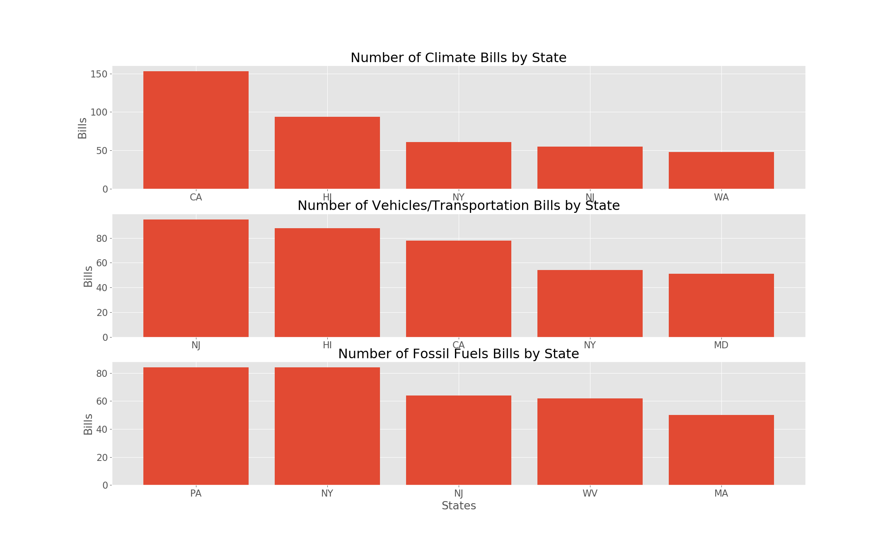

The top chart shows that California and Hawaii have high levels of uncertainty, represented by the number of proposed bills, in the legal structure related to the climate topic. It is important to note that a high number of bills related to a given topic does not necessasrily relate to increased regulations, or proposed regulations relating to that topic. The bills could very well propose a decrease in regulation. The below graph can help provide insight into what the bills pertain to by viewing their counts by party affiliation. 
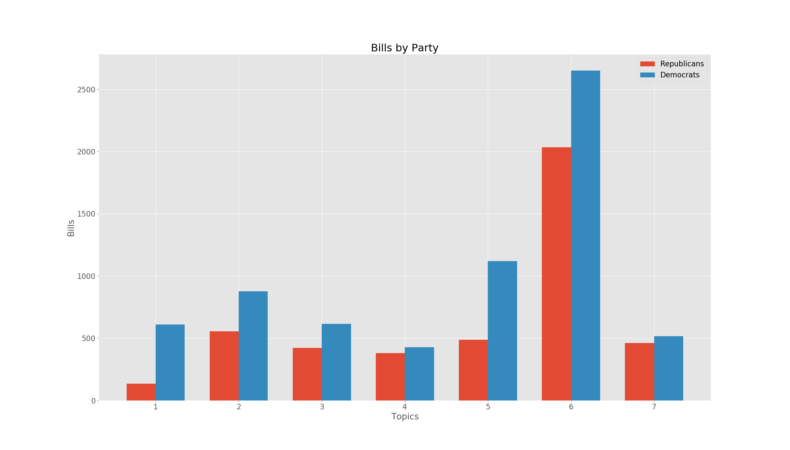

## This is cool and all, but why do we care? 

The remainder of the analysis will take the perspective of a fictional oil and gas company called ACME, a practitioner of hydraulic fracturing. ACME is considering expanding its operations into other states, Massachusetts being one of them. Before they make any decisions they decide to review the pending legislation in MA as it relates to fracking. 

First the perform topic modeling with the above pipeline. They then filter the data by State = MA, primary_topic = 7, status = pending and order them in descending order by the value for subtopic_2, fracking. This directs them to all the pending legislation in MA that most likely relates to their area of interest. The results of the query are shown below. 
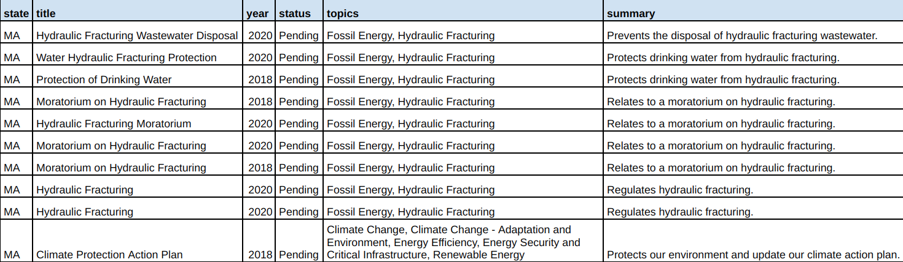

It's easy to see that the first nine results are related to fracking but the tenth result does not mention fracking in the title, topic, or summary. Upon inspection of the [bill](http://custom.statenet.com/public/resources.cgi?id=ID:bill:MA2017000S1870&ciq=ncsl29e&client_md=42dacbaeafb0a47c5f8656f9eb72ff46&mode=current_text) it proposes banning the practice, clearly an important piece of legislation for ACME to review. This example helps illustrate that topic modeling can outperform simple keyword lookups on the pre-existing fields. 

Suppose ACME still wants to expand into new markets and want to identify states with fracking-friendly policy. According to [Gallup](https://news.gallup.com/poll/182075/americans-split-support-fracking-oil-natural-gas.aspx) a majority of Republicans support the practice. It is reasonable to assume that states with more fracking bills proposed by Republicans will have a more favorable legal enviornment towards the practice. ACME can then set a threshold for the amount each document in the corpus relates to the subtopic fracking, lets say .014, and plot the remaining bills by party and state as shown below to gauge a state's friendliness towards the practice. 
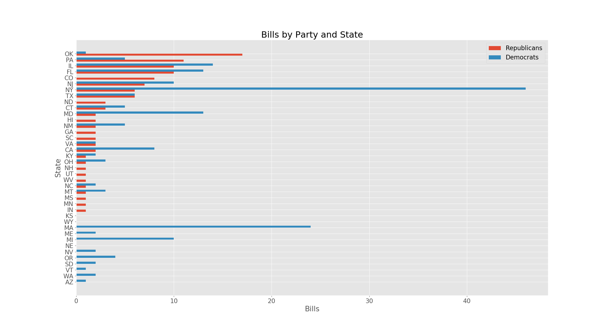

It appears that Pennsylvania has a favorable legal enviornment because there are more proposed bills related to fracking written by Republicans than Democrats. So, ACME once again begins to review the fracking legal enviornment of the state, this time for PA. 

## Conclusion 

Employing topic modeling on bill proposals across all 50 states enables companies to more efficiently monitor the regulatory landscape and assess the potential impact it has on their business. This drives more informed decision-making when it comes to evaluating market opportunities and preparing for changing regulatory conditions. To keep up with the modern pace of business, all companies should consider incorporating legislative topic modeling into their decision-making processes. Neglecting to do so could be considered bad policy :stuck_out_tongue_winking_eye:.