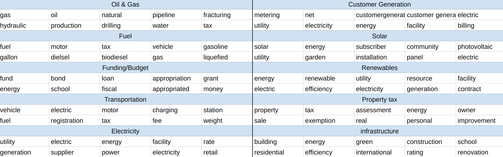
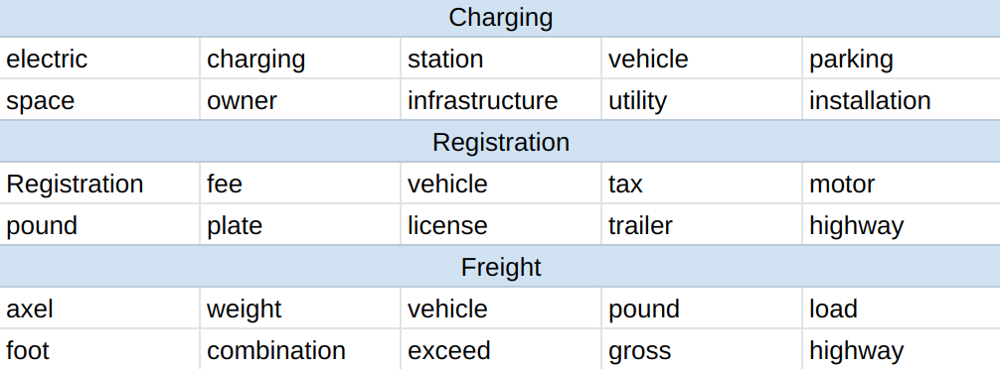
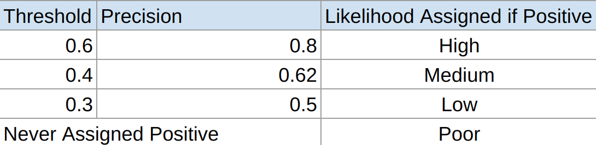
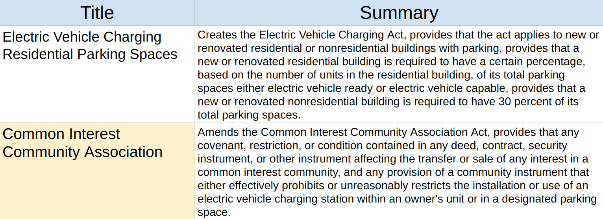

# State Legislation Topic Modeling 

## The Problem 
Changes in laws and regulations can pose major business risks and opportunities across all industry sectors. 
Decision makers need a way to identify relevant legislation to take advantage of and prepare for changes in their industry’s landscape.

## The Solution
Through topic modeling and classification algorithms, enable decision makers to identify relevant bills.

The below analysis performs topic modeling on state legislation pertaining to the energy sector. However, the same framework can be applied to model topics for any of the tracked categories of legislation on the [NCLS' website](https://www.ncsl.org/research/telecommunications-and-information-technology/ncsl-50-state-searchable-bill-tracking-databases.aspx). 

## The Data 

The data used was exctracted from the [NCLS' bill tracking database](https://www.ncsl.org/research/telecommunications-and-information-technology/ncsl-50-state-searchable-bill-tracking-databases.aspx). I chose to focus on bills related to the energy sector but this framework could be repurposed for any of the sectors tracked by the NCLS. The first step in the data collection process was to extract the below table via the database search. 

As you can see, the bills already have topics assigned to them, but these values are often missing or misleading.

Once the table was extracted, Python's BeautifulSoup module was employed to scrape each bills text via the bill link field. 

At this point the dataset contained the following fields: 
-   bill_id (str)
-   title   (str)
-   year    (int)
-   status  (str)
-   topics  (str)
-   summary (str)
-   associated bills (str)
-   date of last action (str)
-   author  (str)
-   text    (str)

Many of these fields contained additional information related to the bill, such as primary authors of the bill and then additional authors. Below are the additional features that were extracted from the previous features:
-   state   (str)
-   additional authors (str)
-   primary_dem (int)
-   primary_rep (int)
-   additional_dem (int)
-   additional_rep  (int)

Duplicate bills were identified and removed by locating bills with identical text and state features, as well as locating bills with identical bill_ids and author. After the cleaning process, 12,711 unique bills remained. 

## Topic Modeling Pipeline 

Each document in the corpus for topic modeling was composed of the text feature for each bill in the dataset. The first step in preparing the feature for topic modeling was to convert the entire string to lowercase and remove punctuation. Each word was then passed through NLTK's WordNet lemmatizer. To reduce the impact of "legalize" and other non-descriptive words a custom stop words list was created and all words in the list were removed. The custom stop words list can be viewed in the file get_stop_words.py located in the src directory. All remaining words in the corpus were then tokenized and a term frequency inverse document frequency (tf_idf) matrix was then created using the tokens. Finally, the tf_idf matrix was then passed through a clustering algorithm (k means, NMF) to derive the topics. 

 

## Topic Selection

An iterative approach was employed to select the number of topics. The corpus was continually passed through the topic modeling pipeline until distinct and interpretable topics were returned. I also evaluated the silhoutte scores to determine how distinct the topics were. At each iteration the top words for each cluster were examined to determine whether or not the cluster was representative of an interpretable topic. Non-informative general words were then added to the stop words list as appropriate. 

The final algorithm landed on for modeling the primary topics was k means hard clustering with k = 13 number of topics. The k means hard clustering algorithm was chosen because it enabled the assignment of a distinct topic to each document in the corpus. Additionally, the hyper parameter k = 13 was chosen because it returned distinct interpretable topics. 

After assigning each document a primary topic, the same process was employed for modeling subtopics except that this time the corpus consisted only of documents belonging to the same primary topic. A different number of subtopics was used for each primary topic but non negative matrix factorization (NMF) was used to model the subtopics. A soft clustering technique was employed because many of the subtopics were less distinct and it seemed likely that each bill could pertain to multiple subtopics. The below table shows subtopics for the transportation primary topic

## Classification   

Now that all the bills were assigned to topics it was time to predict their chances of success. I started by collecting more data, mainly adding which party controlled the legislature for each state and which party controlled the governorship. Note that I only used the primary topics and not the subtopics as inputs to my prediction model. 

Once the data was combined into a single dataset I performed a stratisfied train test split to create a holdout dataset. The holdout set was not touched until the final model was built. I only included bills with statuses of either passed or failed in this process because I was not interested in identifying the pending status.  

After trying several different models (RandomForest, Logistic Regression, XGBoost) I decided to use XGBoost for predicting a bills due to it's flexibility and the quality of results it provided. 

I utilized sklearn's K-Folds Stratisfied Train Test Split function when tuning my models inputs and hyper parameters. I ended up choosing a max depth of 2 and a learning rate of .1. I chose precision as my metric for success because I was concerned with showing descision makers relevant results (bills that were likely to pass). The best performing model had a threshold of .7 which resulted in a precision of .85. 

After building the final model I predicted the probability of each bill in my dataset passing. I then assigned each bill to a likelyhood bucket (high, medium, low and poor) based on the output of the model. The thresholds, precision, and the assigned buckets are outlined in the below table. Note that if a bill was not predicted to pass at a threshold of .3 I assigned it to the poor bucket. 

## Use Case 

Now that we have assigned topics, subtopics and likelihood of passing to each bill its time to put them all together. Lets say that I’m a decision maker for a firm in the electric car charging space based in Illinois. I can use the combined output of all the models and apply the below filters to narrow my results and attention on bills relevant to my business.

-   Sate = Illinois
    Status = Pending
    Likelihood = High
    Topic = Transportation
    Order by subtopic = Charging, Descending 

The below table shows the top two results. As you can see the title of the second bill has nothing to do with charging, and a traditional keyword search based approach would not have picked it up. Upon inspection of the bill it relates to giving condo  owners the right to install charging ports in their assigned parking spaces. Our firm can now get a head start on drafting marketing materials to target this potentially new customer profile. 

## Conclusion 

Employing topic modeling on bill proposals across all 50 states enables companies to more efficiently monitor the regulatory landscape and assess the potential impact it has on their business. This drives more informed decision-making when it comes to evaluating market opportunities and preparing for changing regulatory conditions. To keep up with the modern pace of business, all companies should consider incorporating legislative topic modeling and classification into their decision-making processes. Neglecting to do so could be considered bad policy :stuck_out_tongue_winking_eye:.